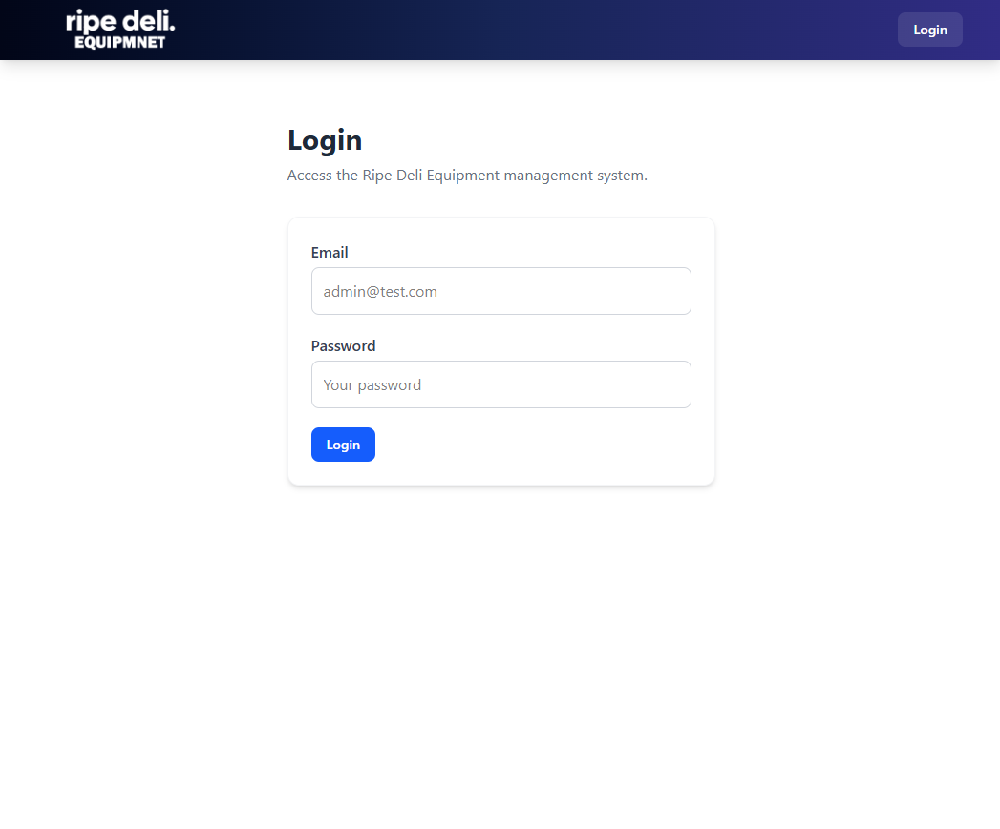
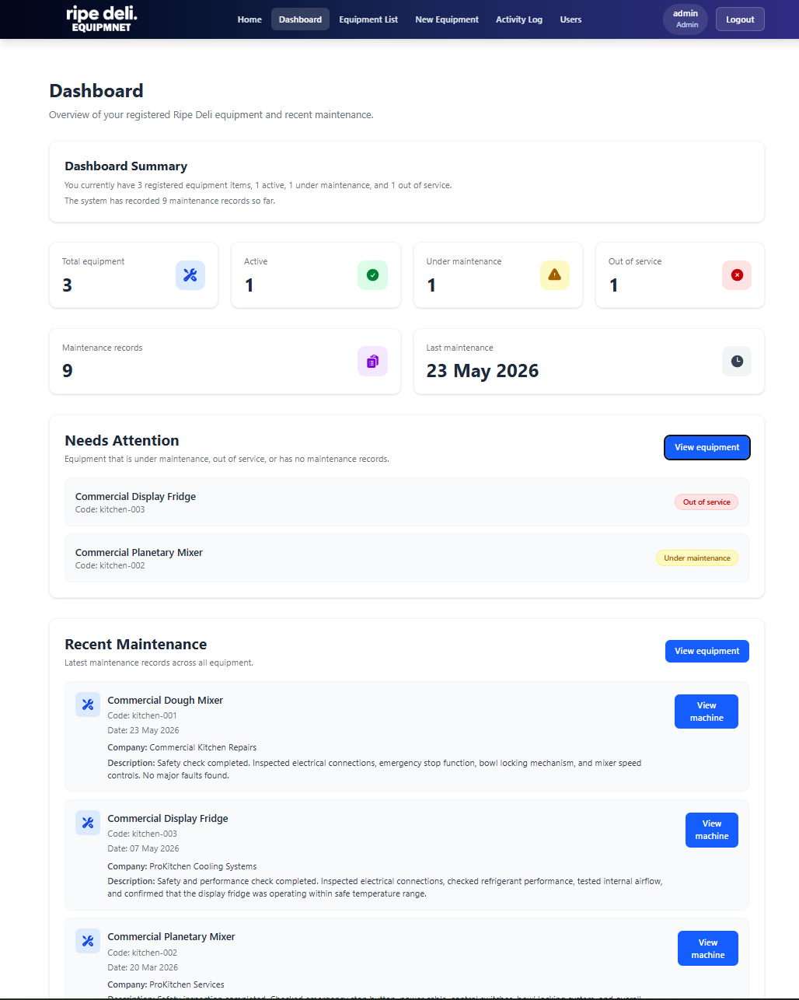
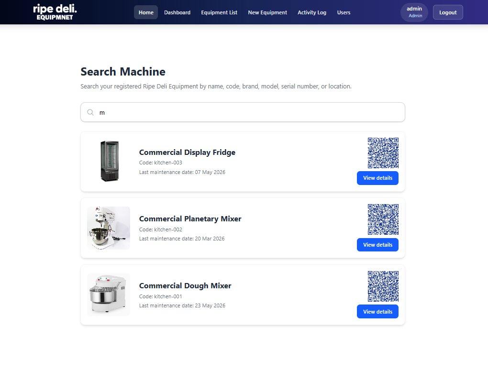
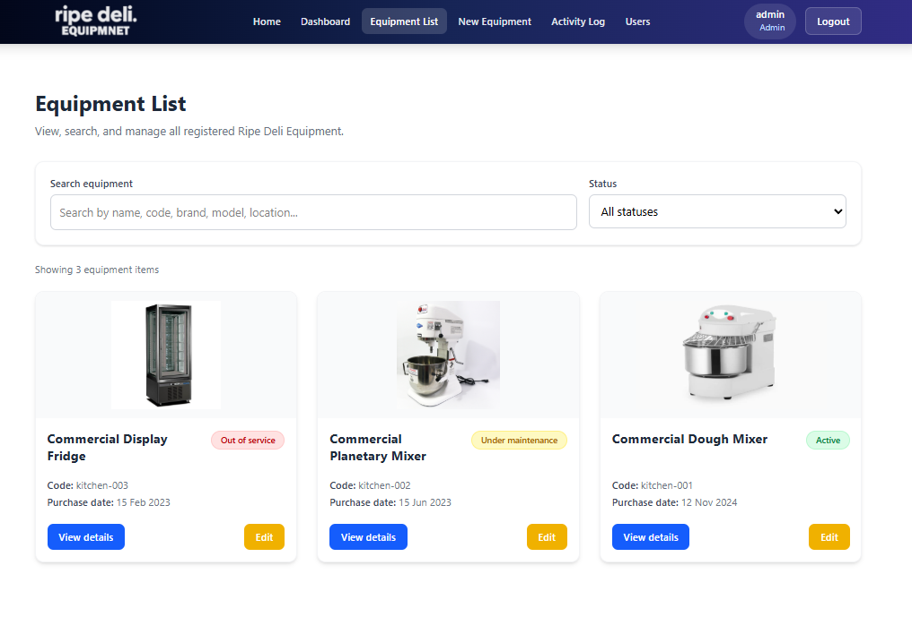
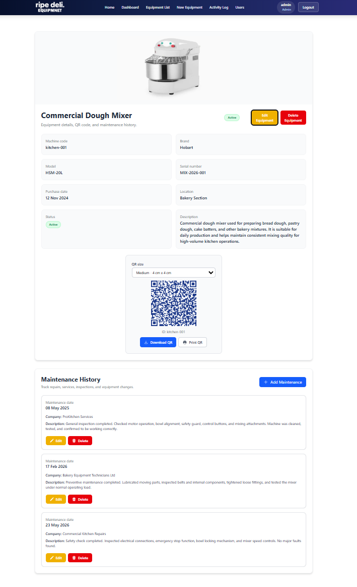
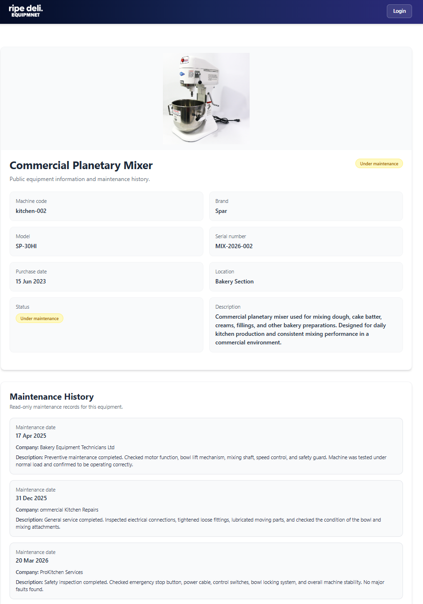

# Equipment QR Management App

A full-stack application for tracking equipment records, maintenance history, QR codes, and managing user access through role-based permissions.

This project started as a solution to a real problem: instead of searching through spreadsheets, folders, or paper records, each piece of equipment can be accessed via QR code and managed from a centralized platform. I built it as a full-stack project using React, TypeScript, Node.js, Express, MongoDB, JWT authentication, and role-based access control.

**Repository:** https://github.com/sergio-ripetti/equipment-qr-management

---

## Table of Contents

- [Quick Start](#quick-start)
- [Live Demo](#live-demo)
- [Requirements](#requirements)
- [Screenshots](#screenshots)
- [Features](#features)
- [User Roles](#user-roles)
- [Technology](#technology-used)
- [Project Structure](#project-structure)
- [Running Locally](#running-locally)
- [Environment Variables](#environment-variables)
- [Available Scripts](#available-scripts)
- [API Endpoints](#api-endpoints)
- [Image Upload](#image-upload)
- [QR Codes](#qr-codes)
- [Activity Logs](#activity-logs)
- [Engineering Decisions](#engineering-decisions)
- [Security and Validation](#security-and-validation)
- [Quality Assurance](#quality-assurance)
- [Troubleshooting](#troubleshooting)
- [Deployment](#deployment)
- [Contributing](#contributing)
- [Future Improvements](#future-improvements)
- [License](#license)

---

## Quick Start

To run the project quickly without reading everything:

```bash
# Clone
git clone https://github.com/sergio-ripetti/equipment-qr-management.git
cd equipment-qr-management

# Frontend
cd client
npm install
# See "Environment Variables" section below to configure client/.env
npm run dev
# Frontend runs at http://localhost:5173

# Backend (in another terminal, from root)
cd server
npm install
# See "Environment Variables" section below to configure server/.env
npm run dev
# Backend runs at http://localhost:5000
```

Done. Both should be running.

---

## Live Demo

Frontend: https://equipment-qr-management.vercel.app/

Backend API: https://equipment-qr-management.onrender.com

---

## Requirements

Before getting started, you need:

- Node.js 18.0.0 or higher
- npm 9.0.0 or higher (comes with Node.js)
- MongoDB (local or Atlas account)
- Cloudinary account (for image uploads)
- A GitHub account (to clone the repo)

Verify you have Node.js:
```bash
node --version
npm --version
```

---

## Screenshots

**Login**


**Dashboard**


**Home - Search**


**Equipment List**


**Equipment Detail**


**Public QR Page**


---

## Features

- Full-stack application with TypeScript on frontend and backend
- Complete equipment CRUD
- QR code generation for each piece of equipment
- Public QR page with equipment details
- Image upload with preview and validation
- Image storage on Cloudinary
- Full maintenance history
- Add, edit, and delete maintenance records
- JWT authentication
- Role-based access control (Admin, Technician, Viewer)
- System activity logging
- User management for administrators
- Dashboard with equipment and maintenance summary
- Responsive interface for desktop and mobile
- MongoDB Atlas integration

---

## User Roles

### Admin

Full access to the system. Can:

- View dashboard
- Search and view equipment
- Create, edit, and delete equipment
- Add, edit, and delete maintenance records
- Download and print QR codes
- Manage other users
- View activity logs

### Technician

Can work with maintenance but cannot create or delete equipment.

- View dashboard
- Search and view equipment
- Add and edit maintenance records
- Download QR codes

Cannot:

- Create or edit equipment
- Delete equipment
- Delete maintenance records
- Manage users
- View logs

### Viewer

Read-only access.

- View dashboard
- Search and view equipment
- View equipment details

Cannot make any changes.

### Public User (QR)

Can scan a QR code and access public equipment information with maintenance history.

---

## Technology Used

**Frontend**
- React 19
- TypeScript
- Vite
- React Router DOM
- Tailwind CSS
- Heroicons
- qrcode.react

**Backend**
- Node.js
- Express 5
- TypeScript
- MongoDB
- Mongoose
- JWT authentication
- bcryptjs
- Multer
- Cloudinary
- CORS

**Deployment**
- Frontend on Vercel
- Backend on Render
- Database on MongoDB Atlas
- Images on Cloudinary

---

## Project Structure

```
equipment-qr-management
├── client
│   ├── public
│   ├── src
│   │   ├── components
│   │   ├── constants
│   │   ├── hooks
│   │   ├── pages
│   │   ├── services
│   │   ├── types
│   │   ├── utils
│   │   ├── App.tsx
│   │   └── main.tsx
│   ├── package.json
│   └── tsconfig.json
│
├── server
│   ├── src
│   │   ├── config
│   │   ├── controllers
│   │   ├── data
│   │   ├── middleware
│   │   ├── models
│   │   ├── routes
│   │   ├── utils
│   │   ├── index.ts
│   │   └── seed.ts
│   ├── package.json
│   └── tsconfig.json
│
├── screenshots
├── .gitignore
└── README.md
```

---

## Running Locally

### 1. Clone the repository

```bash
git clone https://github.com/sergio-ripetti/equipment-qr-management.git
cd equipment-qr-management
```

### 2. Install frontend dependencies

```bash
cd client
npm install
```

### 3. Install backend dependencies

In another terminal from the project root:

```bash
cd server
npm install
```

### 4. Configure environment variables

See the [Environment Variables](#environment-variables) section below.

### 5. Run the backend

From the `server` folder:

```bash
npm run dev
```

Should be running at: http://localhost:5000

Test by opening http://localhost:5000 in your browser, you should see:
```
Equipment QR Management API is running
```

### 6. Run the frontend

From the `client` folder:

```bash
npm run dev
```

Should be running at: http://localhost:5173

---

## Environment Variables

### Frontend (`client/.env`)
```
VITE_API_URL=http://localhost:5000
```

### Backend (`server/.env`)
```
PORT=5000
MONGO_URI=your_mongodb_connection_string
JWT_SECRET=your_jwt_secret

CLOUDINARY_CLOUD_NAME=your_cloudinary_cloud_name
CLOUDINARY_API_KEY=your_cloudinary_api_key
CLOUDINARY_API_SECRET=your_cloudinary_api_secret
```

For production deployment, update `VITE_API_URL` to your public backend URL (e.g., `https://your-backend.onrender.com`).

---

## Available Scripts

### Frontend (from `client` folder)

```bash
npm run dev          # Start development server
npm run build        # Build for production
npm run lint         # Run ESLint
npm run typecheck    # TypeScript type checking
npm run preview      # Preview production build
```

### Backend (from `server` folder)

```bash
npm run dev          # Start server with Nodemon
npm run build        # Compile TypeScript to dist/
npm start            # Run compiled production build
npm run typecheck    # TypeScript type checking
npm run lint         # Run ESLint
npm run seed         # Import demo equipment data to MongoDB
npm run destroy      # Delete demo data
```

---

## API Endpoints

Base URL (local): http://localhost:5000

**Auth**
```
POST /api/auth/login
POST /api/auth/register
GET  /api/auth/profile
```

**Equipment**
```
GET    /api/machines
GET    /api/machines/:id
POST   /api/machines
PUT    /api/machines/:id
DELETE /api/machines/:id
```

**Maintenance**
```
POST   /api/machines/:id/maintenance
PUT    /api/machines/:id/maintenance/:maintenanceIndex
DELETE /api/machines/:id/maintenance/:maintenanceIndex
```

**Users**
```
GET    /api/users
POST   /api/users
PUT    /api/users/:id/role
DELETE /api/users/:id
```

**Activity Logs**
```
GET /api/activity-logs
```

---

## Image Upload

I use Cloudinary to store equipment images. When a user uploads an image, it's saved to Cloudinary instead of locally, so it persists even if the server restarts or gets redeployed.

Flow:
1. User selects image
2. Frontend sends as FormData
3. Backend receives with Multer and uploads to Cloudinary
4. MongoDB stores the Cloudinary URL
5. Frontend displays the image from Cloudinary

Demo images come from the frontend's public folder by default.

---

## QR Codes

Each piece of equipment has a QR code that links to a public page. From there you can:

- View equipment details
- View status
- View maintenance history
- Log in if you have an account

Useful for quick inspections or maintenance checks.

---

## Activity Logs

The system records:

- Equipment created, modified, deleted
- Maintenance added, edited, deleted
- Users created, modified, deleted

Only admins can view the logs.

---

## Engineering Decisions

- **Public QR vs. protected management:** Public QR pages (`/public/machine/:id`) don't require authentication to allow quick access via scan. All management operations are protected by JWT and role-based authorization.

- **Cloudinary for images:** Cloudinary is used instead of local storage to ensure images persist across server restarts, deployments, and horizontal scaling.

- **Backend validation as source of truth:** While the frontend validates for immediate UX feedback, the backend validates all inputs independently. This prevents bypasses and maintains data integrity.

- **Server-side authorization:** Role-based access control happens in server middleware, not in frontend code. Access decisions are never trusted to client-side logic.

- **Activity Logs:** Every CRUD change to equipment, maintenance, and users is recorded for audit, traceability, and production debugging.

---

## Security and Validation

The project implements several security and validation measures:

- Sensitive environment variables excluded from repository (`.env` in `.gitignore`)
- JWT tokens with configured expiration (24 hours)
- Passwords hashed with bcryptjs
- Input validation on critical endpoints (authentication, equipment, maintenance, users)
- TypeScript strict mode enabled on frontend and backend
- Error handling that doesn't expose sensitive details in HTTP 400/500 responses
- Authorization middleware on all protected routes
- CORS protection configured for allowed origins

---

## Quality Assurance

**Manual Verification Completed:**
- ✅ Authentication (login/register/logout)
- ✅ Roles and permissions (Admin, Technician, Viewer, Public)
- ✅ Equipment CRUD (create, list, edit, delete)
- ✅ Maintenance CRUD (add, edit, delete records)
- ✅ User Management (create, change role, delete)
- ✅ Activity Logs (filtering by action, role, search)
- ✅ QR Codes (generation, download, print)
- ✅ Public QR Pages (access without authentication)
- ✅ Image upload and display (Cloudinary)
- ✅ Responsive design (desktop, tablet, mobile)
- ✅ Input validation (length, format, required fields)

**Development Tools:**
- ✅ ESLint (frontend and backend): No errors
- ✅ TypeScript type checking (frontend and backend): No errors
- ✅ Production builds (frontend and backend): No errors

---

## Troubleshooting

### Error: "Port 5000 is already in use"

Port 5000 is already in use. Solutions:

Option 1: Kill the process using the port
```bash
# On Mac/Linux
lsof -i :5000
kill -9 <PID>

# On Windows
netstat -ano | findstr :5000
taskkill /PID <PID> /F
```

Option 2: Change the port in `server/.env`
```
PORT=5001
```

### Error: "Cannot connect to MongoDB"

Verify your `MONGO_URI` in `server/.env`:
- Make sure it's correct
- If using MongoDB Atlas, verify your IP is in the whitelist
- Check that you have internet connection

### Error: "Cloudinary error"

Verify your Cloudinary credentials in `server/.env`:
- `CLOUDINARY_CLOUD_NAME`
- `CLOUDINARY_API_KEY`
- `CLOUDINARY_API_SECRET`

These are sensitive and must be exact. Copy them again from your Cloudinary dashboard.

### Error: "VITE_API_URL is not defined"

Verify that your `client/.env` exists and contains:
```
VITE_API_URL=http://localhost:5000
```

After creating the file, restart the frontend server.

### App runs but doesn't load data

Make sure that:
- The backend is running at http://localhost:5000
- MongoDB is connected (verify MONGO_URI)
- There are no errors in the browser console (open DevTools)

### Error: "npm: command not found"

Node.js is not installed or not in your PATH. Download from https://nodejs.org/ and install the LTS version.

---

## Deployment

Recommended: Frontend on Vercel, backend on Render, database on MongoDB Atlas, images on Cloudinary.

**Frontend on Vercel**

```
Root directory: client
Build command: npm run build
Output directory: dist
```

Environment variable:
```
VITE_API_URL=https://your-backend-url.com
```

**Backend on Render**

```
Root directory: server
Build command: npm install --include=dev && npm run build
Start command: npm start
```

Environment variables (see [Environment Variables](#environment-variables) for complete structure):
```
MONGO_URI=your_mongodb_connection_string
JWT_SECRET=your_jwt_secret
NODE_ENV=production

CLOUDINARY_CLOUD_NAME=your_cloudinary_cloud_name
CLOUDINARY_API_KEY=your_cloudinary_api_key
CLOUDINARY_API_SECRET=your_cloudinary_api_secret
```

---

## Contributing

If you want to contribute:

1. Fork the repo
2. Create a branch for your feature (`git checkout -b feature/AmazingFeature`)
3. Commit your changes (`git commit -m 'Add some AmazingFeature'`)
4. Push to the branch (`git push origin feature/AmazingFeature`)
5. Open a Pull Request

---

## Future Improvements

- Image optimization with Cloudinary
- Automated tests
- Password reset
- Email notifications
- Maintenance expiration dates and reminders
- Advanced analytics in dashboard
- QR label print templates
- Export logs to PDF or CSV
- Improve deployment configuration
- Pagination for large lists

---

## License

This project is licensed under the MIT License. See the `LICENSE` file for details.

---

## Project Status

Fully implemented in TypeScript (frontend and backend) with the following operational features:

- ✅ JWT authentication with role-based control
- ✅ Complete equipment CRUD with validation
- ✅ Image upload and storage on Cloudinary
- ✅ Complete maintenance records with history
- ✅ QR codes with public pages
- ✅ Activity logging and audit trail
- ✅ User management for administrators
- ✅ Error-free builds (frontend and backend)
- ✅ Input validation on critical endpoints
- ✅ Responsive design (desktop, tablet, mobile)

---

## Author

Developed by Sergio Ripetti as a full-stack portfolio project.

Contact: https://github.com/sergio-ripetti
